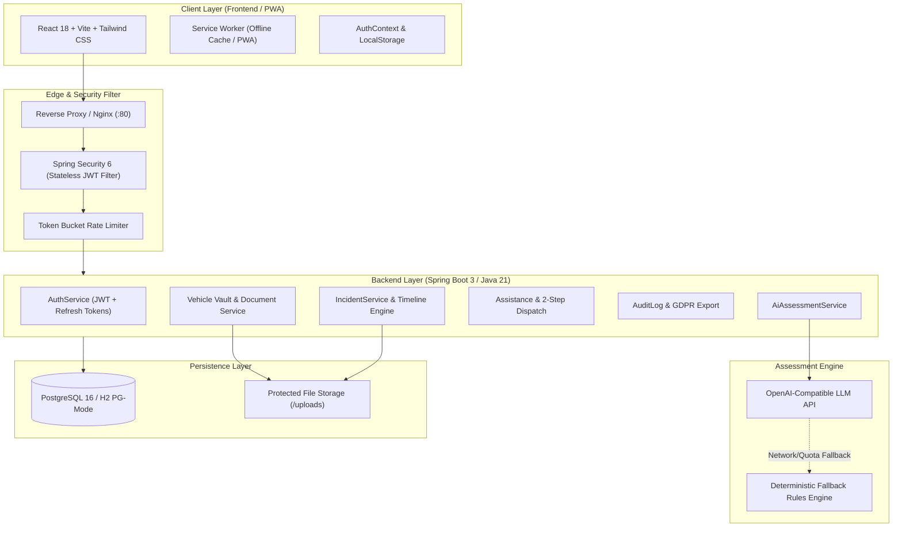

# LIFELINK OS

<div align="center">

**“When something goes wrong, know what to do next.”**

*A production-grade, full-stack incident response and decision-support operating system.*

[](https://spring.io)
[](https://openjdk.org)
[](https://react.dev)
[](https://www.typescriptlang.org)
[](https://tailwindcss.com)
[](https://www.postgresql.org)
[](https://www.docker.com)
[](https://web.dev/progressive-web-apps/)

</div>

---

## 🚨 Critical Safety & Medical Disclaimer

> **IMPORTANT NOTICE:**  
> **LIFELINK OS** is an emergency assistance and decision-support guidance tool. It is **NOT** a replacement for local emergency services (`911` / `112` / `999`).
> - LIFELINK OS **does not** provide official medical diagnoses or triage.
> - LIFELINK OS **does not** establish legal fault or liability in vehicular collisions.
> - If anyone is injured or there is active danger (fire, smoke, highway traffic), immediately dial your local emergency services dispatch before using this app.

---

## 📋 System Architecture



---

## ✨ Key Features & Capabilities

### 1. High-Stakes Incident Intake & Triage
- **Dual Flow Intake:** Dedicated flows for **Breakdown** (flat tire, overheating, dead battery) and **Accident** (minor fender bender, collision, unsafe vehicle).
- **Consent-First Geolocation:** Explicit "Detect My Location" button with precise lat/long reverse-geocoding; zero background/silent tracking; instant manual address fallback.
- **Dynamic Prioritized Protocol:** Instant interactive checklist organized into **Immediate Safety**, **Evidence Collection**, **Information Exchange**, and **Resolution**.
- **Interactive Checklists & Timeline:** Real-time completion checkboxes with live progress bar, custom timestamped incident notes, and photo uploads.

### 2. Dual-Engine AI & Offline Rules Assessment
- **OpenAI-Compatible LLM Integration:** Connects to OpenAI or any local compatible model (Ollama, LM Studio) to evaluate complex incident context.
- **Instant Deterministic Fallback Engine:** If offline, out-of-quota, or in low-connectivity areas, our deterministic rule engine instantaneously evaluates symptoms to produce actionable safety protocols with zero latency.

### 3. Vehicle Vault & Document Expiry Tracking
- **Complete Fleet / Personal Records:** Stores Make, Model, Year, License Plate, and VIN.
- **Expiry Alerts:** Proactive tracking of Insurance, Warranty, and PUC dates with color-coded warning banners (`Active`, `Expiring Soon`, `Expired`).
- **Owner-Scoped Document Storage:** Securely upload and stream registration documents and insurance cards.
- **Service Records Log:** Track oil changes, tire rotations, brake servicing, and emergency repairs with costs and dates.

### 4. Assistance Provider Directory & Safe Dispatch
- Directory of Verified Providers: Towing companies, Roadside Mechanics, Highway Patrol, and Insurers.
- Real-world metadata: Phone dialer links, ETA estimates, base rates, and service coverage notes.
- **Mandatory 2-Step Confirmation Dialog:** Accidental taps on high-stakes actions ("Authorize Dispatch" or "Notify Emergency Contacts") trigger an explicit modal with clear consequences to prevent erroneous dispatches.

### 5. Emergency Contacts & Emergency Mode
- Add and manage contacts with relationship designations and direct phone/SMS links.
- Set a **Primary Contact** and enable/disable automated dispatch notifications.
- **Emergency Disclaimer Banner:** Persistent, high-contrast banner with 1-tap emergency dispatch (`911` / `112`).

### 6. Privacy, Security & GDPR Controls
- **Owner-Scoped Data:** All queries enforce authenticated user identity via Spring Data JPA.
- **Token Security:** Short-lived JWT access tokens + rotating cryptographically-secure refresh tokens.
- **Password Protection:** BCrypt hashing with strong salt rounds.
- **GDPR Export & Account Deletion:** Download complete JSON archive of all incidents, vehicles, timeline events, and settings, or request permanent account erasure.

---

## 🚀 Quickstart & Setup

### Option 1: Docker Compose (Recommended for Full Stack)

Run the entire platform (PostgreSQL 16, Spring Boot 3 backend, and Vite+Nginx frontend) with one command:

```bash
# Clone and navigate to project root
cd lifelink

# Copy sample environment variables
cp .env.example .env

# Build and start all services
docker compose up --build
```

- **Frontend App:** [http://localhost](http://localhost) (or [http://localhost:80](http://localhost:80))
- **Backend REST API:** [http://localhost:8080](http://localhost:8080)
- **OpenAPI / Swagger UI:** [http://localhost:8080/swagger-ui.html](http://localhost:8080/swagger-ui.html)

---

### Option 2: Local Standalone Development

#### 1. Backend (Java 21+ / Spring Boot 3)
The backend defaults to an embedded in-memory PostgreSQL-compatible database with pre-seeded demo records for zero-setup instant evaluation:

```bash
cd lifelink/backend

# Run backend with Maven
mvn spring-boot:run
```
*Backend runs at `http://localhost:8080`.*

#### 2. Frontend (React 18 / Vite / TypeScript)
```bash
cd lifelink/frontend

# Install dependencies
npm install

# Start development server
npm run dev
```
*Frontend runs at `http://localhost:5173` (with automatic proxy to `http://localhost:8080`).*

---

## 🔑 Demo Credentials

To evaluate the system immediately without manual registration, use the pre-seeded account or click the **"Demo Quick-Login"** button on the Login page:

| Role | Email | Password | Pre-seeded Records |
|---|---|---|---|
| **Demo Driver** | `driver@lifelink.os` | `Lifelink123!` | 2 Vehicles (Tesla Model 3, Ford F-150), 2 Emergency Contacts, 2 Past Incidents, 4 Verified Providers |

---

## 🧪 Automated Testing & Verification

Both frontend and backend are covered by automated unit and integration test suites:

### Backend Tests
```bash
cd lifelink/backend
mvn test
```
*Includes `AuthServiceTest`, `VehicleServiceTest`, `AiAssessmentServiceTest`, and full end-to-end `IncidentWorkflowIntegrationTest`.*

### Frontend Tests
```bash
cd lifelink/frontend
npm run test
```
*Executes Vitest component tests verifying badge rendering, landing page CTAs, emergency disclaimers, and 2-step dispatch confirmation dialogs.*

---

## ⚙️ Environment Variables

### Root / Backend Configuration (`backend/.env` or system env):
| Variable | Default | Purpose |
|---|---|---|
| `SPRING_PROFILES_ACTIVE` | `dev` | Profile (`dev` uses H2 PG-mode, `prod` uses PostgreSQL) |
| `SPRING_DATASOURCE_URL` | `jdbc:postgresql://db:5432/lifelink` | PostgreSQL connection URL |
| `SPRING_DATASOURCE_USERNAME` | `lifelink_user` | Database user |
| `SPRING_DATASOURCE_PASSWORD` | `lifelink_secret` | Database password |
| `LIFELINK_JWT_SECRET` | *(64-char key)* | HMAC-SHA256 signature key |
| `OPENAI_API_KEY` | *(Optional)* | OpenAI key for LLM assessment (defaults to deterministic offline engine if blank) |
| `OPENAI_API_URL` | `https://api.openai.com/v1` | LLM API base URL |
| `LIFELINK_UPLOAD_DIR` | `lifelink-uploads` | Path for protected uploaded files at rest |

---

## 📚 Detailed Documentation

- [Architecture & Extensibility Guide](file:///docs/ARCHITECTURE.md)
- [REST API Reference & OpenAPI Specification](file:///docs/API.md)
- [Offline PWA & AI Triage Rules Matrix](file:///docs/OFFLINE_AND_AI.md)

---

## 📄 License & Attribution

Designed and built for LIFELINK OS. All rights reserved.
>>>>>>> 1589b49 (feat: LIFELINK OS full-stack MVP implementation)
