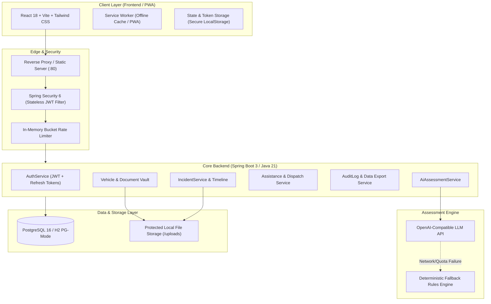

# LIFELINK OS - System Architecture & Design Specification

> **Promise:** *"When something goes wrong, know what to do next."*

---

## 1. High-Level Architecture Overview

LIFELINK OS is designed as an incident response platform with high resilience, strict tenant isolation, and deterministic fallbacks for high-stress situations.



---

## 2. Monorepo Structure

```
lifelink/
├── backend/                        # Spring Boot 3 + Java 21 REST API
│   ├── src/main/java/com/lifelink/os/
│   │   ├── config/                 # SecurityConfig, RateLimitingFilter, OpenApiConfig, DataInitializer
│   │   ├── controller/             # REST Endpoints (Auth, Incidents, Vehicles, Providers, Contacts, Settings, AI)
│   │   ├── domain/                 # 15 JPA Entities (User, Incident, Vehicle, Document, Assistance, AuditLog, etc.)
│   │   ├── dto/                    # Request & Response Data Transfer Objects
│   │   ├── repository/             # Spring Data JPA Repositories
│   │   └── service/                # Business Logic (JWT Auth, AI Triage, File Storage, Audit Logging)
│   ├── src/main/resources/
│   │   ├── db/migration/           # Flyway Migrations (V1 Schema, V2 Demo Seeds)
│   │   └── application.properties  # Profile-driven configs (Postgres & H2 Fallback)
│   ├── pom.xml                     # Maven build configuration
│   └── Dockerfile                  # Multi-stage Temurin-21 JRE container
├── frontend/                       # React 18 + Vite + TypeScript PWA
│   ├── public/                     # Icons, manifest.json, sw.js (Offline PWA)
│   ├── src/
│   │   ├── api/                    # Axios clients with auto-refresh token interceptors
│   │   ├── components/             # Reusable UI (Navbar, Footer, Disclaimers, Modals, Badges)
│   │   ├── context/                # AuthContext (state, tokens, demo login)
│   │   ├── pages/                  # Landing, Intake, Incident Detail, Vault, Contacts, Settings
│   │   ├── test/                   # Vitest unit & integration tests
│   │   └── types.ts                # TypeScript interfaces matching backend models
│   ├── package.json
│   ├── tailwind.config.js
│   ├── nginx.conf                  # Production reverse proxy
│   └── Dockerfile                  # Multi-stage Vite + Nginx container
├── docs/                           # Architecture, API specs, Offline & AI guides
├── docker-compose.yml              # Single-command full-stack containerized deployment
└── README.md                       # Comprehensive guide, setup, and credentials
```

---

## 3. Core Security & Privacy Model

1. **Owner-Scoped Authorization:**
   - Every protected database query (`findRecentByUser`, `findByVehicle`, etc.) enforces the authenticated `User` context obtained from the validated JWT subject. Users cannot read, modify, or delete resources belonging to others.

2. **JWT Lifecycle:**
   - **Access Token:** Short-lived (15 minutes by default). Carries user identity and role.
   - **Refresh Token:** Cryptographically secure 64-byte random string stored hashed in database with expiration and revocation support. Allows seamless token renewal via `/api/auth/refresh`.

3. **Rate Limiting:**
   - Built-in token-bucket rate limiter (`RateLimitingFilter`) prevents abuse and brute-force attacks on sensitive endpoints (`/api/auth/login`, `/api/incidents/create`, `/api/ai/assess`).

4. **File Protection at Rest:**
   - Files are stored with UUID-randomized filenames in non-web-accessible directories (`lifelink-uploads/`). Files can only be streamed through authenticated endpoints validating resource ownership.

5. **Explicit Geolocation Consent:**
   - LIFELINK OS never initiates background GPS polling. The browser Geolocation API is called only when the user explicitly clicks **"Detect My Location"** during intake. Users can enter a manual address or cross-street at any time.

6. **Safety & Legal Disclaimers:**
   - Clearly disclaims that the system is a decision-support guide, does not replace emergency 911/112 dispatch, does not determine legal accident fault, and does not provide medical diagnoses.

---

## 4. Multi-Domain Incident Extensibility

The domain model is designed to support additional incident domains without schema refactoring:

| Domain | Example Incidents | Checklist Modules | Specialized Metadata |
|---|---|---|---|
| **Vehicles (Current MVP)** | Breakdown (flat tire, overheating, dead battery) & Accident (fender bender, collision) | Hazard lights, safety triangle, insurance exchange, photo capture | VIN, Plate, Towing Provider |
| **Home (Extension)** | Pipe burst, electrical short, lock-out, storm roof damage | Main shutoff valve, circuit breaker, flood damage photos | Policy number, Emergency plumber |
| **Travel (Extension)** | Missed flight, lost baggage, passport loss, medical abroad | Embassy notification, airline claim filing, consular contacts | Passport copy, Travel insurer |
| **Document / Device (Extension)** | Identity theft, compromised device, lost credit card | Card freeze, credit bureau alert, remote device wipe | Bank hotline, Police FIR log |

Each domain maps into the canonical `Incident`, `IncidentAction` (checklists), and `IncidentAttachment` tables with custom category tags.
