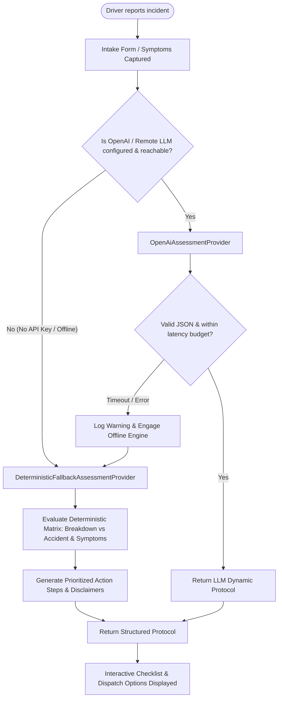

# LIFELINK OS - Offline Architecture & AI Triage Engine

> **Critical Safety Principle:** *A driver stranded in a tunnel, dead-zone, or cellular brownout cannot wait for cloud connectivity to receive life-saving hazard instructions.*

---

## 1. Dual-Tier Intelligence Architecture

LIFELINK OS employs a hybrid assessment model that combines modern LLM situational reasoning with an instantaneous, deterministic offline rules engine.

---

## 2. Deterministic Rule Matrix

When running offline or in air-gapped / zero-credential mode, the engine evaluates structured heuristics based on incident nature and reported symptoms:

### A. Vehicle Accidents
1. **Injuries Present (`INJURY` symptom or toggle):**
   - **Urgency:** `CRITICAL`
   - **Immediate Actions:**
     - Call 911 / 112 immediately. Do not move injured occupants unless there is imminent fire hazard.
     - Turn off vehicle ignition to prevent spark and battery ignition.
     - Move uninjured passengers behind roadway guardrail or barrier.
   - **Assistance Recommendation:** `EMERGENCY_911`

2. **Multi-Vehicle Collision (`COLLISION`, `UNSAFE_VEHICLE`):**
   - **Urgency:** `HIGH`
   - **Immediate Actions:**
     - Hazard lights on, set safety triangle 50m behind vehicle.
     - Document scene: photo wide-angles before vehicles are moved.
     - Exchange insurance credentials, driver license, and vehicle registration.
     - Do not argue or admit fault on scene.
   - **Assistance Recommendation:** `TOW_TRUCK` / `POLICE`

3. **Minor Fender Bender:**
   - **Urgency:** `MEDIUM`
   - **Immediate Actions:**
     - Move vehicle to shoulder if drivable.
     - Exchange insurance policy numbers and phone numbers.
     - Photograph license plates and damage on both vehicles.

---

### B. Vehicle Breakdowns
1. **Overheating / Smoke (`OVERHEATING`, `SMOKE`):**
   - **Urgency:** `HIGH`
   - **Immediate Actions:**
     - Turn off engine immediately; DO NOT open radiator cap while hot (risk of severe steam burns).
     - Step behind highway guardrail.
   - **Assistance Recommendation:** `ROADSIDE_ASSISTANCE` / `TOW_TRUCK`

2. **Flat Tire (`FLAT_TIRE`):**
   - **Urgency:** `MEDIUM`
   - **Immediate Actions:**
     - Park on level, solid ground away from moving traffic lane.
     - Engage emergency parking brake.
     - If on active highway shoulder without safe clearance, request professional roadside service rather than attempting roadside tire change.
   - **Assistance Recommendation:** `MOBILE_MECHANIC` / `ROADSIDE_ASSISTANCE`

3. **Dead Battery (`DEAD_BATTERY`):**
   - **Urgency:** `LOW`
   - **Immediate Actions:**
     - Turn off all accessories, lights, and AC.
     - Prepare jumper cables or request jump-start assistance.
   - **Assistance Recommendation:** `ROADSIDE_ASSISTANCE`

---

## 3. PWA Offline Features & Service Worker

The LIFELINK OS frontend includes progressive web application (PWA) capabilities:

1. **Service Worker (`public/sw.js`):**
   - Caches HTML, CSS, JavaScript, icons, and static assets.
   - Enables the application shell to load instantly without internet connection.

2. **Web App Manifest (`public/manifest.json`):**
   - Allows home screen installation on iOS, Android, macOS, and Windows.
   - High-contrast emergency theme colors (`#0f172a` slate background, `#dc2626` emergency red accent).

3. **Local State & Cached Vault:**
   - Active user profile, vehicle policies, and emergency contacts are cached locally in browser storage so vital phone numbers and policy numbers remain visible even if cell reception drops entirely.
